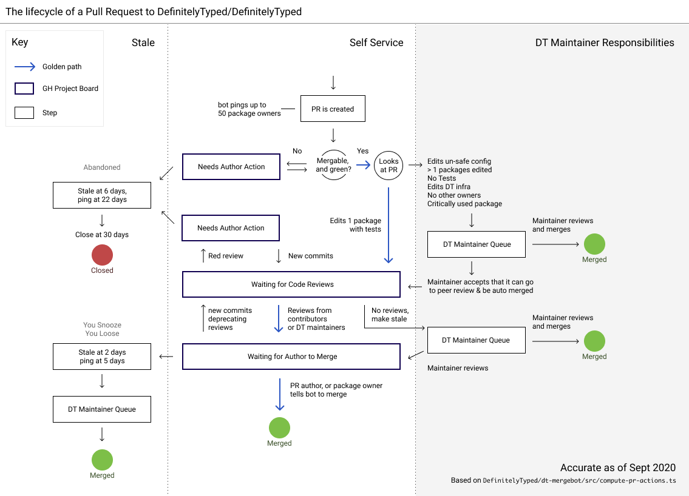

_Disclaimer: This could be out of date, the source of truth is always [compute-pr-actions.ts](https://github.com/DefinitelyTyped/dt-mergebot/blob/master/src/compute-pr-actions.ts)_

<!-- https://www.figma.com/file/qE7BDiEucqI55Q9u0yZO3b/dt-pr-lifecycle?node-id=6%3A7 -->

### What PRs does the bot ignore

- Draft PRs
- Closed PRs

### What type of PRs need to be reviewed by a DT maintainer

- PRs which affect DT infrastructure
- PRs which affect more than 50 Definition Owners
- PRs which affect extremely popular packages (5m downloads per month)
- PRs which add new packages
- PRs which change DT types with no tests
- PRs which change DT types and there are no other Definition Owners
- PRs which change a DT module's infra (`tsconfig.json` etc)

PRs that are blessed (see `info.maintainerBlessed`) are excluded when
possible.

### Idle PR Removal

When a PR:

- Has merge conflicts, CI is failing or has Reviews which reject the most recent commit
- Has not had any commits/comments/reviews/review comments in the last three weeks

it will get a ping that it has about a week for something to happen.

Then, assuming no new activities, a PR which:

- Has merge conflicts, CI is failing or has Reviews which reject the most recent commit
- Has not had any commits/comments/reviews/review comments in the last 30 days

will be closed.

For PRs that are ready to merge but were not, there is a similar (but
much shorter) progression: pinged after 4 days, and moved to YSYL state
after 8.

### Cleanup

A [daily script](../src/scripts/daily.ts) is running every night, cutting the `Recently Merged` column to 50.  It also removes closed PRs from other columns as a safeguard in case the bot missed a PR closing event.
